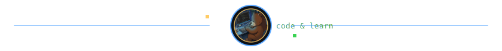

<p align="center">
  
</p>

<h1 align="center">YIXIANG YIN</h1>

<p align="center">
  Undergraduate student at Huazhong University of Science and Technology<br />
  Exploring AI agents, multimodal learning, and the craft of building useful things
</p>

<p align="center">
  <a href="https://github.com/Bearcoder6">
    
  </a>
  
</p>

<p align="center">
  
</p>

<table>
  <tr>
    <td width="52%" valign="top">
      <h3>About</h3>
      <p>I am YIXIANG YIN, an undergraduate student from China. I learn by building small experiments, reading papers, and turning notes into working ideas.</p>
    </td>
    <td width="48%" valign="top">
      <h3>Research focus</h3>
      <ul>
        <li>AI agent workflows</li>
        <li>Multimodal large language models</li>
        <li>Machine learning fundamentals</li>
      </ul>
    </td>
  </tr>
</table>

### Toolkit

`Python` &nbsp; `C / C++` &nbsp; `Java`

<p align="center">
  
</p>

<p align="center">
  
</p>

### Currently exploring

```text
> studying machine learning
> exploring AI agent workflows
> building small projects and notes
> staying curious
```

<p align="center">
  
</p>

<p align="center">
  <sub>Thanks for visiting. Keep building and keep learning.</sub>
</p>
