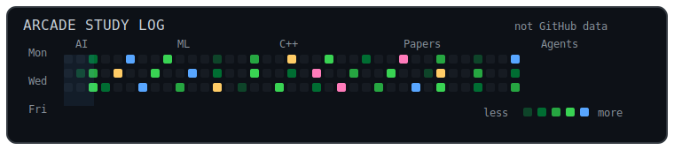

<p align="center">
  
</p>

<h2 align="center">Hi, I'm YIXIANG YIN</h2>

<p align="center">
  Undergraduate student at Huazhong University of Science and Technology<br />
  Interested in AI Agents, MLLMs, and Machine Learning
</p>

<p align="center">
  <a href="https://github.com/Bearcoder6">
    
  </a>
  
  
  
</p>

<p align="center">
  
</p>

<p align="center">
  
</p>

### About

I am YIXIANG YIN, an undergraduate student from China. I am currently exploring how AI systems are built, especially AI Agents, multimodal large language models, and machine learning fundamentals.

I like learning by building small experiments, reading notes and papers, and gradually turning ideas into something useful.

### Interests

- AI Agents
- Multimodal Large Language Models
- Machine Learning
- Programming fundamentals

### Languages

```text
C / C++    Python    Java
```

<p align="center">
  
</p>

### Currently

```text
> studying machine learning
> exploring AI agent workflows
> building small projects and notes
> staying curious
```

<p align="center">
  
</p>

<p align="center">
  <sub>Thanks for visiting. Keep building, keep learning.</sub>
</p>
