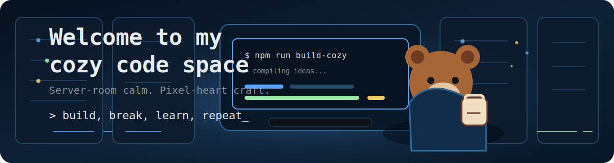
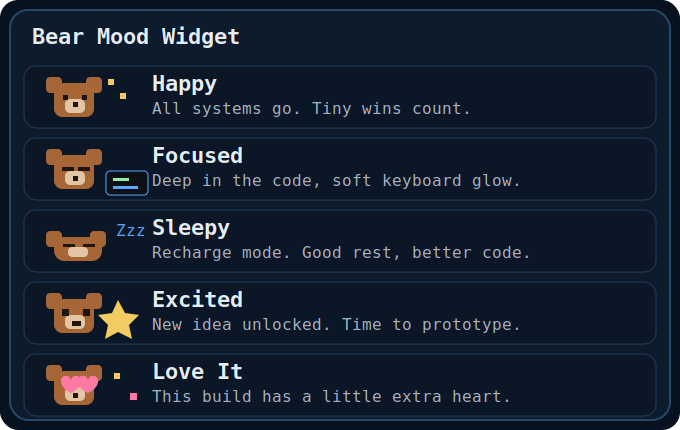
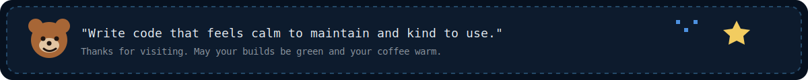

<!--
  Cozy Bear Developer Profile README

  Quick customization checklist:
  - Replace project placeholders with your real repositories when ready.
  - Edit the status chips to match what you are currently doing.
  - Keep assets in ./assets so relative paths work on GitHub.
-->

<p align="center">
  
</p>

<h1 align="center">Hello, I'm YIXIANG YIN</h1>

<p align="center">
  <strong>Undergraduate student at Huazhong University of Science and Technology</strong><br />
  Exploring AI Agents, MLLMs, and the systems that make intelligence useful.
</p>

<p align="center">
  <a href="https://github.com/Bearcoder6">
    
  </a>
</p>

<table>
  <tr>
    <td><strong>Focus</strong><br />AI Agents</td>
    <td><strong>Currently</strong><br />Learning MLLMs</td>
    <td><strong>Interest</strong><br />Machine Learning</td>
    <td><strong>Languages</strong><br />C/C++, Python, Java</td>
    <td><strong>Mode</strong><br />Build, learn, repeat</td>
  </tr>
</table>

<table>
  <tr>
    <td width="58%" valign="top">
      <h2>About Me</h2>
      <p>
        I am YIXIANG YIN, an undergraduate student at Huazhong University of Science
        and Technology, from China. I am interested in AI Agents, MLLMs, machine learning,
        and the engineering behind intelligent systems.
      </p>
      <p>
        I like learning by building: starting from small experiments, understanding how
        things work, and slowly turning ideas into reliable tools.
      </p>
      <pre><code>print("Building, learning, and staying curious.")</code></pre>
    </td>
    <td width="42%" valign="top">
      <h2>Bear Mood Widget</h2>
      
      <br />
      
    </td>
  </tr>
</table>

## Featured Projects

<table>
  <tr>
    <td width="33%" valign="top">
      <h3>AI Learning Lab</h3>
      <p>An AI / machine learning project I am building or studying. Repository link coming soon.</p>
      <p><strong>Area:</strong> AI Agents, MLLMs, ML</p>
      <p><strong>Status:</strong> Organizing notes and experiments</p>
    </td>
    <td width="33%" valign="top">
      <h3>Programming Practice</h3>
      <p>A programming experiment focused on algorithms, systems, or useful tooling. Repository link coming soon.</p>
      <p><strong>Stack:</strong> C/C++, Python, Java</p>
      <p><strong>Status:</strong> Building fundamentals</p>
    </td>
    <td width="33%" valign="top">
      <h3>Research Notes</h3>
      <p>A learning note, demo, or research-inspired implementation. Repository link coming soon.</p>
      <p><strong>Area:</strong> Learning, practice, exploration</p>
      <p><strong>Status:</strong> Collecting ideas</p>
    </td>
  </tr>
</table>

## Interests & Languages

<p>
  
  
  
  
  
  
</p>

## GitHub Stats

<table>
  <tr>
    <td width="50%">
      
    </td>
    <td width="50%">
      
    </td>
  </tr>
</table>

If the stat cards are taking a nap, here is the short version: I like consistent commits, readable code, and projects that survive real use.

## Terminal Notes

```text
$ cat motivation.txt
> Stay curious.
> Keep building.
> Make small things feel loved.
> Refactor gently.
> You have time. Ship with care.
```

<p align="center">
  
</p>

<p align="center">
  
</p>
