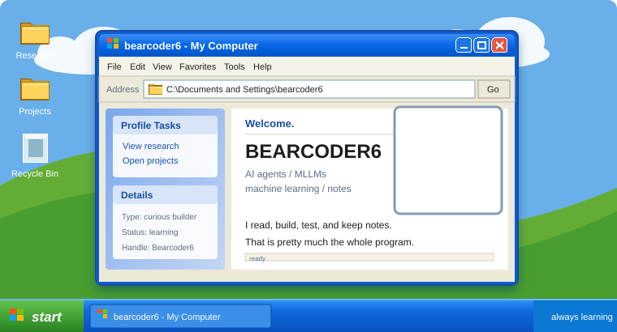
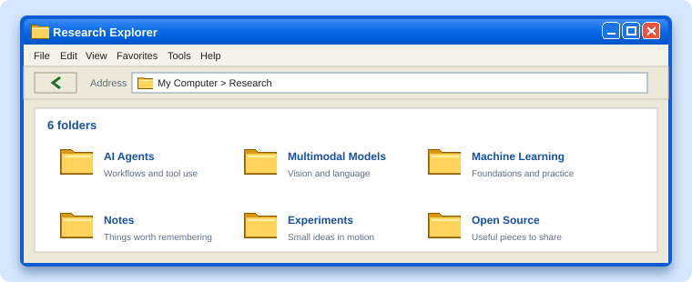
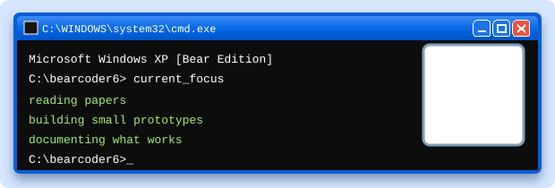
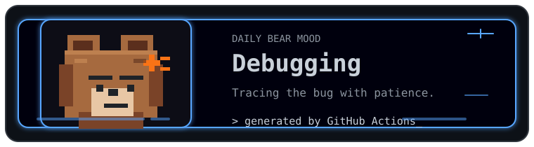

  

<h1 align="center">Bearcoder6.exe</h1>

  AI agents / multimodal models / machine learning 
  Reading, building, testing, and keeping useful notes.

  

<h3 align="center">Tool Kit</h3>

  <code>Python</code>&nbsp;&nbsp;
  <code>C / C++</code>&nbsp;&nbsp;
  <code>Java</code>

  

  

  

